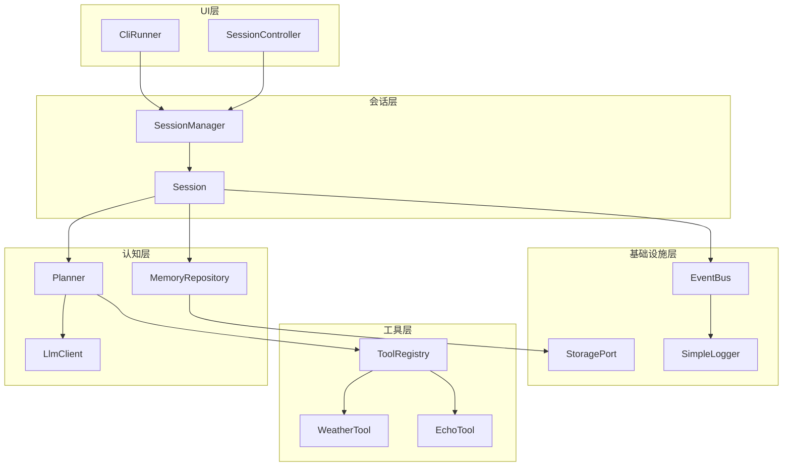
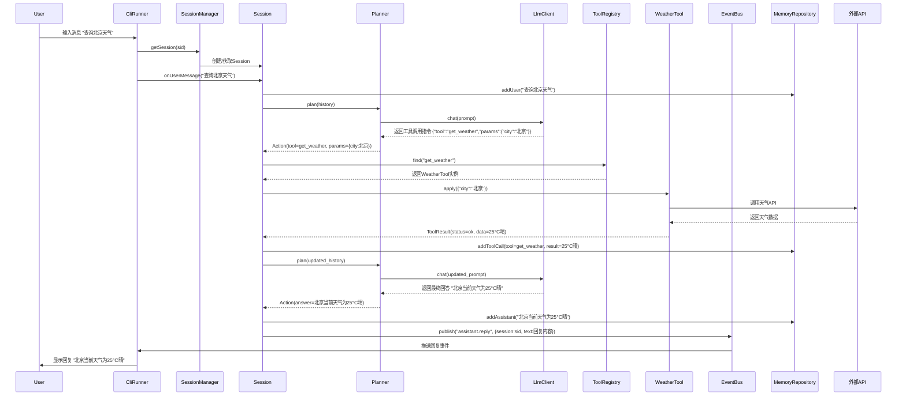
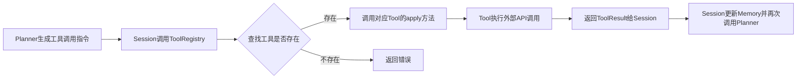
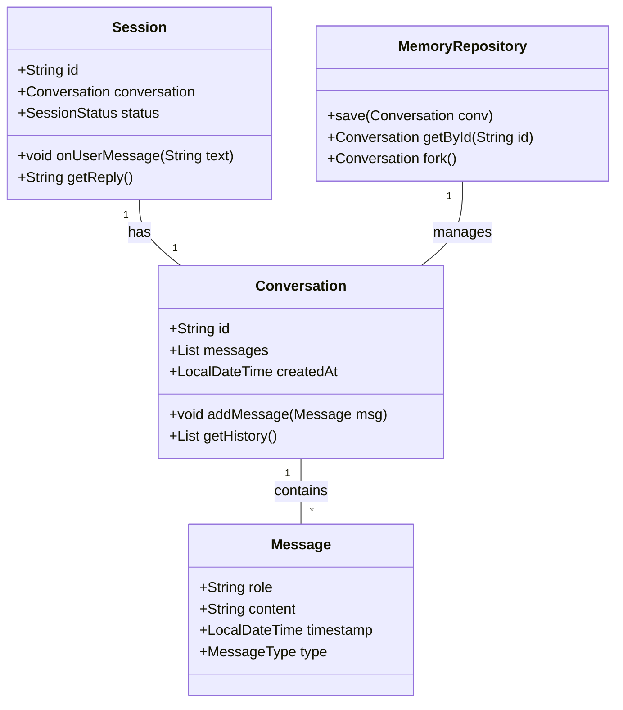

# Self Agent-AI Code Companion

# 零、概述

实现一个简单的 AI 代码助手

目标：在 Spring Boot（不依赖 AI 框架）上实现一个可运行、可测试、可扩展的最小 Agent，以“代码质量 + 设计模式 + 清晰分层”为核心。

原则：

1. 单一职责（SRP）
2. 面向接口（DIP）
3. 显式边界（层之间只通过接口/事件通讯）
4. 轻量设计模式：Factory、Strategy、Observer、Builder、Adapter、Decorator、Repository

## 核心设计原则

系统设计遵循以下核心原则：

1. **单一职责原则（SRP）**：每个模块仅负责一个明确的功能领域，例如指令解析模块专注于输入格式转换，工具调用模块专注于外部服务交互。这一原则可降低模块间的依赖复杂度，便于独立开发与维护。
2. **依赖倒置原则（DIP）**：系统中高层模块不直接依赖低层模块的具体实现，而是通过抽象接口进行交互。例如，业务逻辑层依赖工具调用接口，而非具体的HTTP客户端实现，从而提高系统对底层技术变更的适应性。
3. **显式边界原则**：系统各层（如表现层、业务层、数据层）之间的通信严格通过预定义接口或事件机制进行，禁止跨层直接访问实现类。这一设计可确保层间职责清晰，减少因边界模糊导致的维护困难。
4. **轻量设计模式选型**：优先采用Factory（对象创建）、Strategy（算法封装）、Observer（事件通知）、Builder（复杂对象构建）、Adapter（接口适配）、Decorator（功能增强）、Repository（数据访问）等轻量级设计模式。选型理由基于最小化Agent的资源约束，上述模式可在不引入额外复杂度的前提下，提升代码复用性与扩展性，符合"最小而完备"的设计理念。

## 范围定义

本项目的功能边界明确如下：

- **包含功能**：支持命令行界面（CLI）作为用户交互入口，提供基础指令解析与响应能力；实现核心工具调用机制，支持通过配置文件定义工具接口，并执行简单的外部服务调用（如文件操作、基础数据查询）。
- **暂不包含功能**：高级特性如多模态输入处理（语音、图像）、自然语言理解（NLU）、复杂任务规划与记忆机制等，以确保系统聚焦于基础架构验证与设计原则落地，避免因功能过度扩展导致的实现复杂度失控。

# 一、目录结构

```
src/main/java
└─ com.plusl.ai.codewith
   ├─ AgentApplication.java
   ├─ infra
   │  ├─ config
   │  │  ├─ AppProperties.java
   │  │  ├─ JacksonConfig.java
   │  │  └─ BusConfig.java
   │  ├─ event
   │  │  ├─ EventBus.java (接口)
   │  │  ├─ SpringEventBus.java
   │  │  └─ AgentEvent.java
   │  ├─ storage
   │  │  ├─ StoragePort.java
   │  │  ├─ InMemoryStorage.java
   │  │  └─ StorageConfig.java
   │  └─ log
   │     └─ SimpleLogger.java
   ├─ tool
   │  ├─ Tool.java
   │  ├─ ToolRegistry.java
   │  ├─ WeatherTool.java
   │  └─ EchoTool.java
   ├─ cognition
   │  ├─ client
   │  │  ├─ LlmClient.java (接口)
   │  │  ├─ OpenAiClient.java
   │  │  └─ MockLlmClient.java
   │  ├─ planner
   │  │  ├─ Planner.java
   │  │  ├─ ReActPlanner.java
   │  │  └─ Action.java
   │  └─ memory
   │     ├─ MemoryRepository.java
   │     └─ Conversation.java
   ├─ session
   │  ├─ Session.java
   │  ├─ SessionManager.java
   │  └─ SessionController.java
   └─ ui
      └─ CliRunner.java

```

# 二、分层 & 设计模式一览

```
┌──────────────┐  Observer  ┌──────────────┐
│  ui/cli      │◄──────────►│  session     │  Factory/Builder
└──────────────┘            └──────────────┘
        ▲                           │
        │                           │  Repository
        │                    ┌──────────────┐
        │                    │  cognition   │  Strategy
        │                    └──────────────┘
        │                           │
        │                    ┌──────────────┐
        │                    │  tool        │  Registry/Adapter
        │                    └──────────────┘
        │                           │
        │                    ┌──────────────┐
        └────────────────────┤  infra       │
                             └──────────────┘

```



为什么要这样分层？—— 逐层拆解“职责 + 边界 + 演进”

---

## 2.0 先给出一条主线

“任何一次改动，只应该影响一个方块。”

“单一职责”

分层的目的就是：

• 把 **“变化速率不同”** 的东西**隔离**开；

• 把 “知识不同” 的人（或未来的你）隔离开；

• 把 **“技术决策”** 与 **“业务决策”** 隔离开。

下面从底到顶，逐层说明：它到底挡什么变化、藏什么知识、给什么价值。

## 2.1 Infrastructure（基础设施层）

作用：
a. 屏蔽“技术细节”——IO、序列化、线程、配置、日志。
b. 向整个系统提供“稳定且可替换”的最小公共服务集合。
c. 让上层对“Spring 是否存在、RestTemplate 是否换成 WebClient、日志是否换为 Logback”一无所知。

例子：

• 今天用 Map，明天换 Redis → 仅改 InMemoryStorage → 其它层无感知。

• 将来引入异步事件总线 Kafka → 仅改 SpringEventBus → 其它层继续 publish(topic, payload)。

关键设计决策：

– 所有接口都以“最小抽象”暴露，如 `StoragePort.put(k,v)`，而不是“JPA save(entity)”。

– 该层**允许**依赖 Spring，但**禁止**被其它层反向依赖（通过接口隔离）。

## 2.2 Tool（工具层）

作用：

a. 把“外部世界的能力”封装成“无副作用的函数”——让认知层像调本地方法一样调用天气、计算器、数据库。

b. 通过统一接口（Tool）+ 注册表（ToolRegistry）实现“热插拔”——新增工具不碰 Planner。

c. 把“如何调用第三方 API”隔离在最小代码单元里，方便 Mock 与单测。

设计模式：

– **Strategy 策略模式**：不同工具实现同一接口。

– **Registry 服务定位器模式（单例&工厂）**：运行期收集所有 @Component Tool。

– **Adapter 适配器模式**：如果某个 API 返回格式怪异，写一个 AdapterTool 把数据转成标准 ToolResult。

变化场景：

– 天气 API 从 OpenWeatherMap 换成高德 → 只改 WeatherTool。

– 需要“执行 Python 代码” → 新增 CodeTool 即可。

## 2. 3 Cognition（认知层）

作用：

a. 负责“Agent 的大脑”——LLM 调用、Prompt 组装、思考策略（ReAct、CoT、Reflexion…）。

b. 把“策略”与“数据”分离：Planner 是策略，Memory 是数据。

c. 为 Session 层提供“一句话”接口：`plan(history) → Action`，屏蔽所有 LLM 细节。

设计模式：

- Strategy：Planner 接口 + ReActPlanner/CoTPlanner 实现，可运行时切换。
- Repository：MemoryRepository 隐藏存储实现，Conversation 实体只关心领域字段。
- Factory：LlmClient 通过 Spring Profile 创建 OpenAiClient vs MockLlmClient。

变化场景：

- 从 GPT-3.5 升级到 GPT-4 → 仅改 OpenAiClient 的 model 字段。
- 未来引入本地 Llama.cpp → 新增 LlamaClient implements LlmClient。
- Prompt 模板优化 → 只改 ReActPlanner，不碰 Session。

认知层通过多种设计模式实现高内聚低耦合，具体如下：

**1. LLM客户端工厂模式**

采用工厂模式（Factory Pattern）封装LLM服务的实例化逻辑，通过`LlmClient`接口定义统一调用标准，结合条件注解（如Spring Profile）动态创建不同实现类。

接口层面，`LlmClient`包含LLM调用的核心方法（如`generate(String prompt)`）；

实现层面，根据环境配置或业务需求，可实例化`OpenAiClient`（对接OpenAI API）、`MockLlmClient`（测试环境模拟）或`LlamaClient`（对接本地Llama.cpp服务）。

例如，通过Spring Profile的`@Profile("prod")`注解激活`OpenAiClient`，`@Profile("test")`激活`MockLlmClient`，新增本地模型时仅需扩展`LlmClient`接口实现`LlamaClient`，无需修改现有调用逻辑。

**2. Planner策略模式**

采用策略模式（Strategy Pattern）设计思考逻辑模块，通过`Planner`接口定义思考策略的统一标准，具体实现类对应不同推理范式。

`Planner`接口包含核心方法`plan(List\\<Message> history) → Action`，其实现类包括`ReActPlanner`（基于ReAct推理框架）和`CoTPlanner`（基于思维链推理框架）。

策略模式的应用使思考逻辑与执行流程解耦，例如优化ReAct的Prompt模板时，仅需修改`ReActPlanner`的模板配置，无需调整`Planner`接口或上层调用逻辑。

**3. 数据访问Repository模式**

采用仓库模式（Repository Pattern）封装会话数据的存储逻辑，通过`MemoryRepository`接口定义数据操作标准（如`save(History)`、`getById(String sessionId)`），底层实现可灵活切换为Redis、数据库或本地缓存，上层模块（如Planner）通过接口访问数据，无需关注存储介质细节。

### Planner工作流组件交互

Planner模块的工作流体现“策略与数据分离”的协同逻辑，具体流程如下：

1. **数据获取**：Planner通过`MemoryRepository`接口从会话数据存储中获取历史对话记录（`history`），确保思考过程基于完整上下文。
2. **Prompt构建**：根据自身策略（如ReAct或CoT），Planner将历史记录与预设模板（如ReAct的“Thought-Action-Observation”框架）组装为结构化Prompt。
3. **LLM调用**：Planner通过`LlmClient`接口调用指定LLM服务（如OpenAI GPT-4或本地Llama模型），传入构建后的Prompt。
4. **Action解析**：LLM返回文本结果后，Planner按策略规则解析生成`Action`对象（包含工具调用指令、参数等），并返回给Session层。

该流程中，Planner专注于思考逻辑（Prompt构建、策略执行、结果解析），`MemoryRepository`专注于数据存取，`LlmClient`专注于LLM服务适配，三者通过接口交互，实现模块间的低耦合。

## 2.4 Session（会话层）

作用：

a. 管理一次“用户 ↔ Agent”完整生命周期：创建、保持上下文、落盘、清理。

b. 作为事务边界：用户输入→思考→工具→再思考→回复，全部在 Session 内闭环，失败可回滚。

c. 向 UI 层暴露“最小表面”：`onUserMessage(text) → reply`，UI 不用知道 ReAct、Tool、LLM。

设计模式：

- Facade：Session 把 cognition、tool、storage 的多个调用包成一个高阶操作。
- Factory：SessionManager 用 “prototype” 方式生成 Session（保证线程安全）。
- Observer：Session 通过 EventBus 发布事件（assistant.reply），UI 或日志可订阅。

变化场景：

- 增加群聊（多人共享 Session）→ 仅改 Session 内部聚合逻辑。
- 增加权限（用户只能看到自己的会话）→ 在 SessionManager 加鉴权逻辑，不改 cognition。

## 2.5 UI / 交互层

作用：

a. 负责“把 Agent 能力暴露给人类或其它系统”——REST、WebSocket、CLI、Swing、Telegram Bot…

b. 只做“协议转换 + 参数校验”，不含任何业务。

c. 通过 EventBus 接收异步事件，实现推送或日志。

设计模式：

- Adapter：Controller 把 HTTP Request 适配成 Session.onUserMessage。
- Builder：CLI 用 Step Builder 模式优雅地提示用户输入。

变化场景：

- 新增微信小程序 → 增加 WxMpController，复用 SessionManager。
- 从同步 REST 升级为流式 SSE → 仅 UI 层改动，Session 接口不变。

## 2.6 横向看：为什么这五层刚好够用？

- 任何系统只有三种代码：I/O 细节（infra）、业务规则（cognition）、编排/用例（session）。
- 再加“工具”是因为 Agent 领域把“外部能力”提到第一等公民。
- 再加“UI”是因为学习项目要可交互。

=> 五层 = 最小完备集，再多就重复，再少就耦合。

────────────────

## 2.7 一句话总结每层“挡什么”

infra：挡技术换代

tool：挡外部 API 变化

cognition：挡 AI 算法升级

session：挡用户交互模式变化

ui：挡输入输出协议变化

因此，当任何一维需求变化时，你只需“切开那一层的胶带”，其余箱子纹丝不动。

# 三、核心流程

## 用户请求处理时序图



## 工具调用流程图



## 数据模型类图

